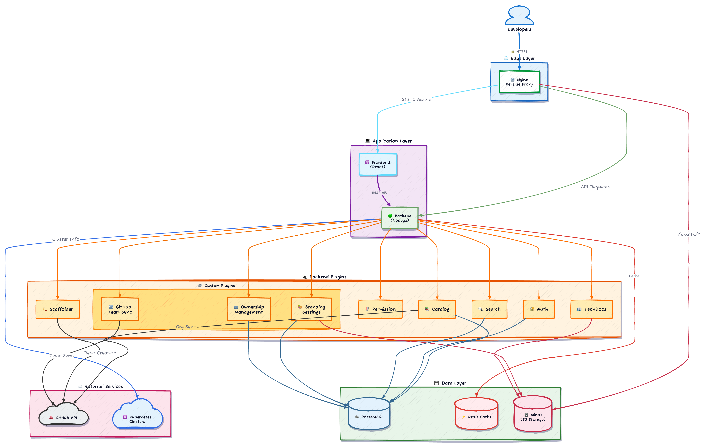
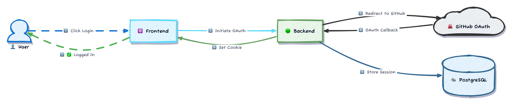
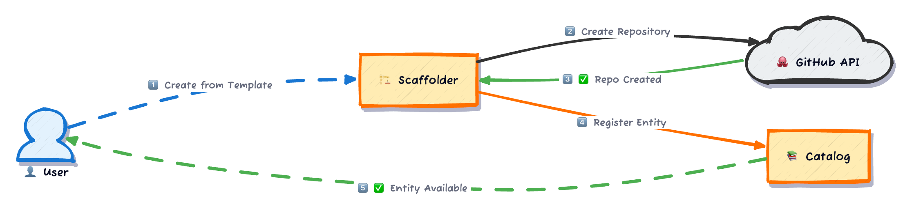
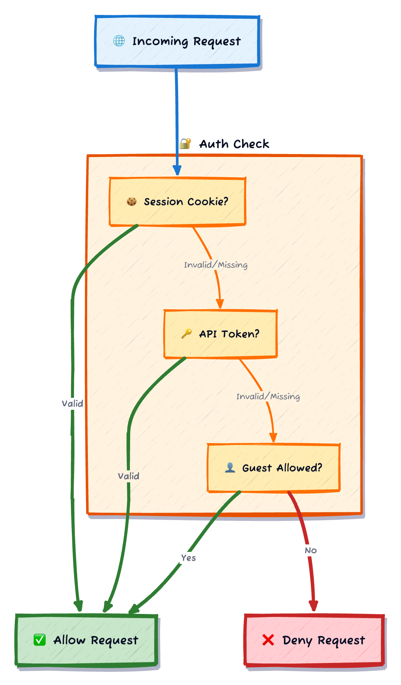
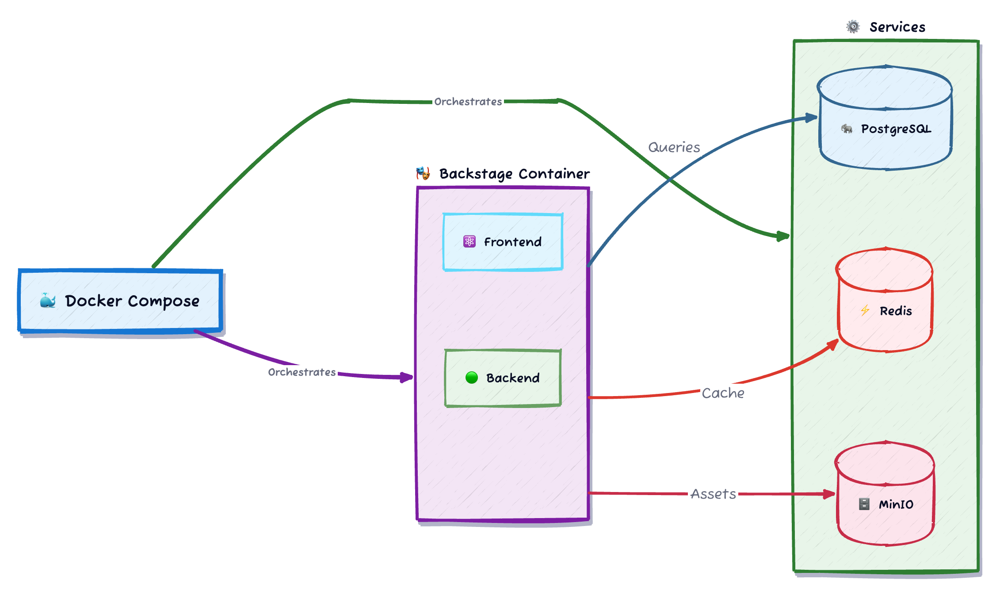

# Cloud Sandbox Architecture

This document describes the architecture of the Cloud Sandbox Backstage developer portal.

## System Overview

Cloud Sandbox is a customized Backstage instance designed to serve as a central developer portal. It provides a unified interface for service discovery, documentation, scaffolding, and team management.

## Architecture Diagram

## Component Descriptions

### Edge Layer

#### Nginx Reverse Proxy

- Terminates TLS connections
- Routes requests to frontend or backend
- Serves static assets from MinIO
- Provides caching headers

### Application Layer

#### Frontend (React)

- Single-page application built with React
- Material-UI component library
- Backstage core components
- Custom branding support

#### Backend (Node.js)

- Express-based HTTP server
- Plugin-based architecture
- Backstage backend framework
- Custom plugin implementations

### Plugin Layer

#### Core Plugins

| Plugin         | Purpose                                  |
| -------------- | ---------------------------------------- |
| **Catalog**    | Software catalog management              |
| **Scaffolder** | Template-based project creation          |
| **TechDocs**   | Documentation generation and serving     |
| **Auth**       | Authentication providers (GitHub, Guest) |
| **Permission** | Role-based access control                |
| **Search**     | Full-text search across entities         |

#### Custom Plugins

| Plugin                   | Purpose                                     |
| ------------------------ | ------------------------------------------- |
| **Branding Settings**    | Admin-configurable organization branding    |
| **Ownership Management** | Orphan detection and ownership reassignment |
| **GitHub Team Sync**     | Bi-directional GitHub team synchronization  |

### Data Layer

#### PostgreSQL

- Primary data store
- Catalog entities
- Authentication tokens
- Plugin state

#### Redis

- Caching layer
- Session storage
- Performance optimization

#### MinIO (S3-Compatible)

- TechDocs static files
- Branding assets (logos)
- Template artifacts

### External Services

#### GitHub API

- OAuth authentication
- Organization/team sync
- Repository scaffolding
- Token management

#### Kubernetes

- Cluster information
- Service discovery
- Deployment status

## Data Flow

### Authentication Flow

### Catalog Sync Flow

### Scaffolding Flow

## Security Architecture

### Authentication

### Authorization

Role-based access control with group membership:

| Role   | Source              | Permissions            |
| ------ | ------------------- | ---------------------- |
| Admin  | `admins` group      | Full access            |
| Editor | `editors` group     | Create/modify entities |
| Viewer | Authenticated users | Read-only access       |
| Guest  | Unauthenticated     | Limited read access    |

## Deployment Architecture

### Docker Compose (Development)

### Production Deployment

For production, consider:

1. **Container Orchestration** - Kubernetes or ECS
2. **Managed Database** - RDS, Cloud SQL, or Azure Database
3. **Managed Redis** - ElastiCache, Cloud Memorystore, or Azure Cache
4. **Object Storage** - S3, GCS, or Azure Blob Storage
5. **Load Balancer** - ALB, Cloud Load Balancing, or Azure LB
6. **CDN** - CloudFront, Cloud CDN, or Azure CDN

## Scalability Considerations

### Horizontal Scaling

- Backend is stateless and can be scaled horizontally
- Use Redis for session storage across instances
- Use PostgreSQL connection pooling (PgBouncer)

### Caching Strategy

- Redis caches catalog queries
- Nginx caches static assets
- TechDocs uses CDN-friendly cache headers

### Performance Optimization

- PostgreSQL indexes on frequently queried columns
- Batch processing for large catalog imports
- Async processing for scaffolder tasks

## Monitoring and Observability

### Health Checks

- `/healthcheck` endpoint for liveness probes
- Database connectivity checks
- External service availability

### Logging

- Structured JSON logging
- Correlation IDs for request tracing
- Log levels configurable via environment

### Metrics

- HTTP request latency
- Database query performance
- Cache hit/miss ratios
- External API call metrics

## Disaster Recovery

### Backup Strategy

| Component     | Backup Method  | Frequency |
| ------------- | -------------- | --------- |
| PostgreSQL    | pg_dump        | Daily     |
| MinIO         | S3 replication | Real-time |
| Configuration | Git repository | On change |

### Recovery Procedures

1. **Database Recovery** - Restore from latest backup
2. **Storage Recovery** - Sync from replica or backup
3. **Application Recovery** - Redeploy from container registry
