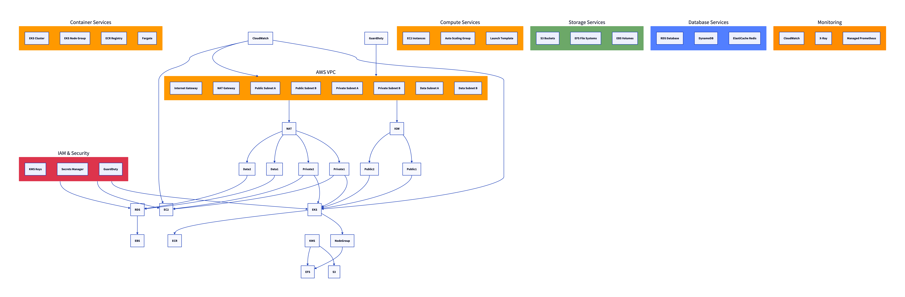

# {{ componentName }} - AWS Infrastructure

{{ description }}

## Architecture Overview



This diagram shows the complete AWS infrastructure stack deployed by this template.

## Resources Included

| Category | Resources | Status |
|----------|-----------|--------|
| Networking | VPC, Subnets, IGW, NAT Gateway, Route Tables | ✅ Enabled❌ Disabled |
| Compute | EC2 Instances, Auto Scaling Groups, Launch Templates | ✅ Enabled❌ Disabled |
| Containers | EKS Cluster, Node Groups, ECR Registry, Fargate | ✅ Enabled❌ Disabled |
| Storage | S3 Buckets, EFS File Systems, EBS Volumes | ✅ Enabled❌ Disabled |
| Database | RDS (PostgreSQL/MySQL), DynamoDB, ElastiCache Redis | ✅ Enabled❌ Disabled |
| Security | IAM Roles, KMS Keys, Secrets Manager, GuardDuty | ✅ Enabled❌ Disabled |
| Monitoring | CloudWatch, X-Ray, Managed Prometheus | ✅ Enabled❌ Disabled |

## Deployment

```bash
# Initialize Terraform
terraform init

# Plan deployment
terraform plan -var="environment={{ environment }}" -var="region={{ region }}" -out=tfplan

# Apply infrastructure
terraform apply tfplan
```

## Configuration

**Environment:** {{ environment }}
**Region:** {{ region }}
**VPC CIDR:** {{ vpc_cidr }}


### Kubernetes Configuration
- **EKS Version:** {{ eks_version }}
- **Node Instance Type:** {{ eks_node_group_instance_types[0] }}
- **Desired Nodes:** {{ eks_desired_nodes }}
- **Min/Max Nodes:** {{ eks_min_nodes }}/{{ eks_max_nodes }}



### Compute Configuration
- **Instance Type:** {{ instance_type }}
- **EBS Volume Size:** {{ ebs_volume_size }} GB



### Database Configuration
- **RDS Instance Class:** {{ rds_instance_class }}
- **RDS Storage:** {{ rds_allocated_storage }} GB
- **Backup Retention:** {{ rds_backup_retention }} days


## Architecture Layers

### Network Layer
- **VPC** with public, private, and data subnets across multiple AZs
- **Internet Gateway** for public internet access
- **NAT Gateway** for private subnet internet access
- **Transit Gateway** for hybrid connectivity (optional)

### Security Layer
- **IAM Roles** with least-privilege access
- **KMS** for encryption at rest
- **Secrets Manager** for credential management
- **GuardDuty** for threat detection

### Container & Compute Layer
- **EKS Cluster** with managed node groups and autoscaling
- **EC2 Instances** with auto-scaling capabilities
- **Container Registry** for Docker images

### Data Layer
- **RDS** for relational database workloads
- **DynamoDB** for NoSQL requirements
- **ElastiCache** Redis for caching
- **S3/EFS** for object and file storage

### Observability Layer
- **CloudWatch** for metrics and logs
- **X-Ray** for distributed tracing
- **Managed Prometheus** for container monitoring

## Testing

Run the Terraform test suite:

```bash
cd tests
terraform test
```

## Security Best Practices

✅ All resources encrypted at rest and in transit
✅ Network segmentation with public/private/data subnets
✅ IAM roles instead of access keys
✅ Secrets stored in AWS Secrets Manager
✅ Security groups with minimal required access
✅ GuardDuty enabled for threat detection

## Documentation

See [docs/](docs/) for detailed documentation.

## Support

For issues and questions, contact the platform team or create an issue in the repository.
